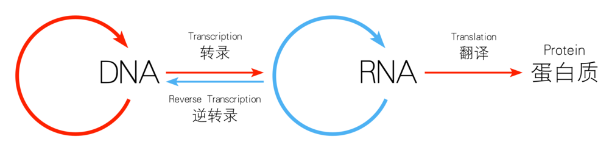

---
menu:
  main:
    parent: menu-evolution
    weight: 1

title: "从达尔文演化论说起"
date: 2024-05-27
author: 祁新

TocOpen: true
ShowToc: true
ShowWordCount: false
ShowReadingTime: false

cover:
  image: images/cover/从演化论说起.jpeg
  alt: 封面图片
  relative: true

summary: 大自然的算法就是累积小确幸来行大运，达尔文称之为演化。演化的载体是基因。基因就像一部连载中的，情节不断发展的连载小说，没有固定的主题。
---

# 天演论

严复所译《天演论》的开篇段落，在一百多年前内忧外患的危难时刻，激发了无数国人的救亡之心：

> 赫胥黎独处一室之中，在英伦之南，背山而面野。槛外诸境，历历如在几下。乃悬想二千年前，当罗马列大将恺彻未到时，此间有何景物。计惟有天造草昧，人功未施，其借征人境者，不过几处荒坟，散见坡陀起伏间。而灌木丛林，蒙茸山麓，未经删治如今日者，则无疑也...

作为一个好奇的人，有关个人与人类命运的那些大问题总是能够抓住我的眼球，而演化论则满足了我对宏大叙事的所有幻想。

许多根本问题，被历史上无数人反复提出、思考、讨论过，但是他们并没有给出简洁的答案。在百年前达尔文提出演化论之后，它发展至今，愈发庄严宏伟。我们如果转而使用演化思想来看这些老问题，就会发现答案竟是如此清澈简明。

这其中的诀窍，就是从演化中发现规律，并总结出它的 [**模型**](https://zh.wikipedia.org/wiki/%E7%A7%91%E5%AD%B8%E6%A8%A1%E5%9E%8B)。生命演化经历了至少35亿年，它的规律和趋势，有着强大的合理性和延续性，一直持续至今。古人云：生年不满百，常怀千岁忧。以一千年的历史经验来看有生之年，当然是有认知优势的。同样，**以亿万年的大趋势来看当下，用演化模型分析现在，更是如观池底游鱼，历历在目。**

此处我所说的模型，如果细究，更应该称为概念模型。它是用一组概念来描述一个系统，以期进一步解释系统的运作原理。如果此概念模型能用图形来表达，则更好。

本系列的主旨既是缘起于此，我以演化为入手处，试图阐释几个要紧关节：**生命演化是怎么进行的？演化想要什么？演化赋予我们什么内禀？**但是，我的主旨却是经由演化，获得模型。认清这几个大问题后，模型在手，智珠在握，很多当下与未来的问题就迎刃而解了。

在此过程中，我阅读了不少关于演化的书籍，也借助互联网，特别是最新的AI技术来帮助自己。为了不影响表达流畅，我将相关的书籍和重要的网络文章的链接放在文末，主要概念的链接则直接在文中给出。文中图片，除了特别标注的，都是我手绘或者由AI生成的。对于不慎侵权的，告知必复。

本系列文章不能视为严谨的科学，只能称为一家之言，因为我没有自己做研究，而是借用于书本与网上的已有信息。**六经注我，我来简述**。我再次加工提炼这些素材，构造出自己的模型，以浅显的语言表达复杂规律，以尽量少的规律解释更多的现象。总之，这既是我边学边做的读书笔记，也是自不量力的一次构建模型的尝试。

人人为我，我为人人。我对知识的分享始终心存景仰与感激，真诚地谢过那些启发我的作者们。我将在本系列的最末尾处统一列出我的参考书目和文章。

# 小确幸与行大运

演化论是达尔文在1859年的《物种起源》中提出的。他说所有的生物在繁殖时，都会产生微小的随机的遗传变异，带有这些变异的个体会发展出不同的能力差异。在自然选择中，某些能力差异会增加了个体的生存繁殖能力，从而导致这些个体的后代更多，反则反之。这样，那些有利于个体的遗传变异得到保留，而那些没有变异或者有不利变异的个体的后代数量则减少甚至消失。

变异会增加生物在各个层次的多样性，这些层面包括种群、个体性状甚至身体的分子构成。

这些变异逐渐累积，如果达到了生物个体间生殖隔离的程度，则导致新物种的产生。

达尔文的学说用一个统一的过程解释了几乎一切物种的产生。这个过程简洁有力，使得它像是一段程序。是的，它就是一个算法。如果我们了解软件编程的话，我们可以认为达尔文的学说是简单的公式：

> 对具有表现功能的数据结构进行有随机性误差的复制。通过筛选，一些复制品能更好地适应环境。

如果让我用一句话解释演化论，我会说：

**演化就是逐渐积攒的小确幸，最后变成了行大运。**

想象我们在玩电脑游戏，比如我喜欢的《[文明](https://baike.baidu.com/item/%E6%96%87%E6%98%8E6/6946347)》系列游戏。我自诩能玩最高的天神级的难度，但其实水平挺烂的，往往几回合下来就要亡国了。怎么办？用大家都知道的办法，存档和读档呗。在几乎每一次获得了些许进展的时候，比如踩到了一个好的村庄，干掉了一个难缠的野蛮人据点，或者攻克了一座敌方城池之后，我马上按下F5按键，快捷存档，然后继续。如果后面进展不顺，我按下F8读档，重新来过。经过这样的SL大法，我也可以偶然通关天神难度了，如此简单。

演化算法也类似的，生物个体在每一次繁殖时，都相当于将其祖祖辈辈积攒的好运气存了档，存在自己的基因中，然后以此为起点，开始新的一局。

当电脑往磁盘上写入存档时，偶然会发生微小错误，比如某个字符写错了，这称之为**突变**。可以认为，在新的一次读档后，我们有可能发现角色的属性有点点不一样了。为了方便讨论，我们将突变定义为是最小的变化，它只指一个字符的数据差别。

这些突变也许给角色某些微小的增强，比如移动更快视野更广，也许会损失角色属性，比如降低了生命值，有时候甚至坏档直接读不出来了。

我越是玩到后来，读档的次数越多，这越是表明我依靠了前面很多次存档不断积攒的运气。当某天我终于通关了最高难度时，这些积攒的小运气已经帮助我完成了一次看似不可能完成的任务。

大自然母亲也是这样。不同的是，她玩的是无限游戏，不用通关，但是这积攒运气的过程一样的。

# 大自然的算法：自然选择

这么多的存档，都曾经被读档后继续运行，直到再次存档。有的直到现在都还在继续，这就是我们现在地球上活着的所有生物个体。

如果我们从现在的这份存档出发，回溯到上一份存档，再回溯到它的上一份存档，如此反复，我们就会找到我们的各个祖先。从他们那儿到我们这里的这条线索，就是遗传。

然而，还是有大部分存档被抛弃，从此那条线索就中断了。为什么这些存档被废弃？因为进展不顺利，要么角色属性不强，要么运气不好，遇到了怪物打不过，或者踩到了坑，总之来不及存档角色就挂了，这类存档成了死档。在达尔文学说中，这个过程称之为[自然选择](https://zh.wikipedia.org/zh-cn/%E8%87%AA%E7%84%B6%E9%80%89%E6%8B%A9)。

自然选择是大自然塑造生命的关键力量。变异是遗传字符的随机组合，是无方向的盲目偶然性。但是通过自然选择，这些随机组合中大部分被废弃了，留下了那些具有适应性的，或者仅仅是运气好的变异。这个过程使得生物能够适应环境。

我们在大自然中看到了许多工程奇迹，比如雄鹰的眼睛、人类的大脑、蝙蝠的耳朵等等。很难相信，一个算法会达到如此成就。但是，生命从40亿年前开始经过了亿万个世代，如果你用几十亿次存档读档来玩一个游戏，又有什么不可能呢？

演化算法的威力在于，它是迭代的、累积的、分布的，这简直是软件工程中敏捷开发的最佳实践。它将艰巨任务拆解分散在广阔时空中，由无数个进程同时运行，千头万绪，齐头并进。

尽管如此，演化算法始终都只是一组前后相继的机械步骤，不用借助任何外在的智能，用盲目的偶然来推进，以自然选择来校验。这是科学，是彻底的唯物主义。

这里头的关键在于，存在一种数据结构，它能通过编码控制角色的属性，又能被复制和重构，这就是我们大家都熟知的基因了。

自然选择作用在随机性的基因突变上促使生物的进化，简单又合理。但是，仅仅凭自然选择这个单方向的作用力，就真的能够造就生物界如此纷繁复杂的多样性和复杂性吗？

大家的怀疑没错，这个问题需要一个更形象的模型来阐述。在继续前进之前，我们先补课，了解一下基因的概念。

# 基因：连载小说

基因是可遗传的DNA片段，每个DNA序列有许多个基因。单个基因是DNA序列中的一块固定区域、一块片段。

物种的DNA像是一条固定的流水生产线，它的产品就是这个物种的个体。其中每一道生产工序，被称为一个基因座。在该工序干活的工人，因为他们具备类似的技能，被称为 **等位基因**，它们之间是竞争上岗的，在某个体的DNA上某基因座处只能有一个等位基因存在。但是就该物种而言，其所有基因座上的所有等位基因的所有可能的组合，我们称之为该物种的 **基因库**。该物种的某个体身上具体存在的基因组合，也就是它的染色体，被称为 **基因型**。**表现型** 则是某个体的实际外表特征，比如体型、样貌、肤色等等。

基因型对个体的成长有极大的影响，但是它并非唯一的决定因素。即使基因型完全相同的个体也会表现出不同的外貌。比如人类的同卵双胞胎拥有完全相同的基因型，他们的外貌非常相似，但还是略有不同，父母总能够区分开。另外，他们的指纹也不一样。

基因型塑性是指基因型对其表现型的影响大小。其数值低则说明环境因素对该物种的影响比较大，反之亦然。如此说来，人类的型塑性应该是偏高的。

下面我们看一看基因如何传递遗传信息。

[沃森](https://zh.wikipedia.org/wiki/%E8%A9%B9%E5%A7%86%E6%96%AF%C2%B7%E6%9D%9C%E5%A8%81%C2%B7%E6%B2%83%E6%A3%AE) 和[克里克](https://zh.wikipedia.org/wiki/%E5%BC%97%E6%9C%97%E8%A5%BF%E6%96%AF%C2%B7%E5%85%8B%E9%87%8C%E5%85%8B) 等人提出的 [**中心法则**](https://zh.wikipedia.org/wiki/%E4%B8%AD%E5%BF%83%E6%B3%95%E5%89%87) 明确地揭示了生命活动的基本过程，之后霍华德·马丁·特明用逆转录酶过程进一步完善了这一法则。至此，遗传信息的传递过程清晰地展示在我们眼前。

人们原先以为单个基因简单地对应着单个蛋白质合成，但是1961年弗朗索瓦·雅各布和雅克·莫诺在研究大肠杆菌乳糖代谢过程中发现了有些基因不会合成蛋白质，只起调控作用。

因此，人们把能翻译为蛋白质的这部分基因称为 **结构基因**，这就是我在上一节说的数据。在软件编程中，每一份数据都有其对应的业务数据类型，比如姓名、地址、手机号码、备注说明等等，我们可以认为能最终翻译为蛋白质的那些基因，就代表着这些具有不同含义的数据类型。

有些DNA片段其本身并不进行转录，但对其邻近的数据之转录起控制作用。还有些DNA片段被转录了但是不被翻译为蛋白质。这两部分DNA片段都被称为 **调控基因**，是DNA中的控制编码。因为它们的存在，我们认为DNA中数据-也就是蛋白质编码-以不连续的方式出现在DNA序列中的各处，它们之间由控制编码分割开来。

科学家在研究小鸡卵清蛋白基因时，发现其转录形成的RNA字符长度只有其DNA长度的1/4，这就是因为那些非数据的控制编码在转录过程中被切除了。

以上图中心法则的视角来看，在DNA编码被转录为RNA时，会进行第一次裁剪，该裁剪是由DNA本身上的调控基因来控制的。以人类为例，大约70%的DNA编码会被转录为RNA。之后，也并非这部分转录为RNA的编码都会被翻译为蛋白质肽链，此时会进行第二次裁剪。第二次裁剪，是由已经转录到RNA上来的基因中的一部分 - 被称为RNA基因 - 来完成的。以人类为例，在前面的70%编码中，又有一大部分来调控RNA的翻译过程，最终大约只有3%的编码会被翻译为蛋白质肽链。

控制编码-也就是调控基因-是真核生物出现之后才有的，之前的原核生物的基因都简单地对应着蛋白质，都是纯粹的数据。

此外，玉米夫人[麦克林托克](https://zh.wikipedia.org/wiki/%E5%B7%B4%E5%B7%B4%E6%8B%89%C2%B7%E9%BA%A6%E5%85%8B%E6%9E%97%E6%89%98%E5%85%8B) 甚至发现，某些基因可以从DNA复制到RNA之后，再粘贴回DNA上。甚至可以在DNA自身上，先在某处剪切然后粘贴在另一处。这与文本处理相比，几乎没有差别。

正是这种复制-粘贴的机制，在DNA中形成了大量重复编码，也就是说同一种基因出现在DNA序列的多处，这种机制甚至成为高等生物的DNA编码的主流。我认为这就像软件编程中的代码复用一样，同一种数据被多处代码复用，基因的复用方式是直接将要复用的基因拷贝粘贴到要使用它的控制编码旁边去。

在原核生物和低等真核生物中，基因组大小与生物形态的复杂性正相关。但是在更高等的真核生物中，这种相关性就不存在了。正是因为大量复用了已有的数据类型，人类的基因组长度远远比不上变形虫。

由于这种灵活的调控与组装机制，基因具备了更大的应变能力。原核生物的基因最为简明。越是后来的新进物种，其基因中的控制编码比例越多，充斥着重复的、被注释掉的、四处粘贴的段落。

所以，基因远远不是我们通常所认为的那样，是一部神圣严肃的经书，而是一段情节不断发展中的连载小说。