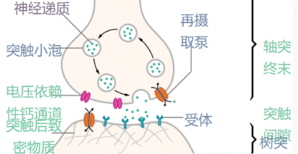
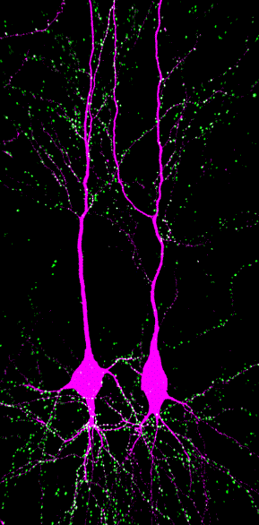
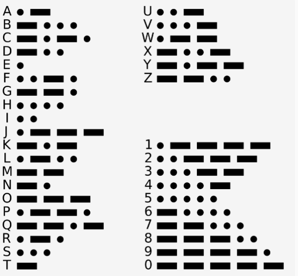
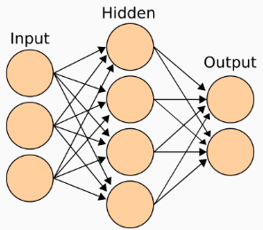

大脑中，神经元是最基本的计算单元，神经元传递的是电信号。大脑约有 860 亿神经元，理解了神经元的运作及其互联，也就知道了大脑运作的底层逻辑。

此时，我是以建模的思路来铺陈这些内容的，并非复述生物医学领域对大脑与神经元的发现，而是以为大脑建模为目的，挑选那些对模型最为关键的信息来陈述，而且尽量简化，以求达到信息简要，符合逻辑，能够理解的程度。

本节的一些内容来自《得到》中王立铭老师的 “[脑科学五十讲](https://www.igetget.com/course/%E7%8E%8B%E7%AB%8B%E9%93%AD%C2%B7%E8%84%91%E7%A7%91%E5%AD%A650%E8%AE%B2?param=DkBf54iWfG0&token=D75xge6dAqWVpPasx2VYRzmGO14jPZ)” 课程。这个系列对于大脑的基本机制的介绍非常简明清晰的，胜过许多专业的书籍。本节图片，除了有标注的之外，都来自该讲义。

## 轴突与树突

西班牙人 [拉蒙·卡哈尔](https://zh.wikipedia.org/zh-cn/%E5%9C%A3%E5%9C%B0%E4%BA%9A%E5%93%A5%C2%B7%E6%8B%89%E8%92%99-%E5%8D%A1%E5%93%88%E5%B0%94) 开创了对神经元的研究，并因此获得1906年诺贝尔医学奖。他改进了高尔基发明的铬银染色法之后，对动物的神经组织进行了观察，留下了很多精美的手绘图片。根据这些观察，卡哈尔认定神经细胞是一个个独立的结构功能单元，被称为神经元。下图是一幅卡哈尔手绘的神经元图片。

神经元拥有一个椭圆的细胞体，细胞体的相反位置会伸出两类不同的枝杈。一根细细的长枝，长度可能是细胞体的几倍乃至几十倍，名字叫 [**轴突**](https://zh.wikipedia.org/zh-cn/%E8%BD%B4%E7%AA%81)，以及有一丛细而密的短树枝丛，叫 [**树突**](https://zh.wikipedia.org/zh-cn/%E6%A0%91%E7%AA%81)。上图中，中间下部的 a 点上方的很多树枝样汇聚的黑色根节处，就是神经元的细胞体。细胞体上面那密密麻麻的像树枝一样由粗到细分散开来的线条，就是树突。一个神经元的树突可以有一万个左右。a 点所在的细线，就是轴突，它孤零零地延申开去，并没有分叉或者分叉很少。

上图是卡哈尔的另外一张手绘图，可以看到，字母标识的是神经元的细胞体，其上方树突分散很多，而轴突就像孤零零的根须一样，从细胞体向下方其他地方延申而去。大脑发育的早期，神经元的轴突需要持续生长延长，找到需要连接的另外神经元的树突位置，这对于人类童年的大脑发育非常重要。

卡哈尔的一个重要发现是认识到神经元的电信号有明确的传递方向。**它从树突传向细胞体，再从细胞体传到轴突**。一个神经元用树突衔接其他的神经元的轴突，然后自己的轴突又伸向另外神经元的树突丛。

在神经元的轴突末端，信号能够跨越细胞之间的间隙，进入下一个神经元的树突。神经元之间的接触面被称为[突触](https://zh.wikipedia.org/zh-cn/%E7%AA%81%E8%A7%A6)，突触就像树枝上的小瘤子。我们如果双手握拳，在胸前相对接近。拳头上突起的指骨节就像是突触。重要的是，神经元之间并没有直接接触，而是存在着间隙，这个间隙的宽度在几个纳米到几十个纳米之间。关于它的作用，我们下面再讲。

现在我们知道了，神经元的轴突就像电话线，是用来传递电信号的。而它的树突是用来接受其他神经元的信号的。一个神经元可以接受许多个其他神经元的信号，也可以将自己的电信号传递给其他许多个神经元。

一个典型的神经元，图片来自维基百科。

轴突就像是神经元上的长长导线。那么，电信号如何在长长的轴突上传递的呢？

任何导体都存在电阻，电阻导致电线发热，电流衰减。比如，电信号沿着电话线传递了远距离之后，都会有声音模糊、音量变小、出现杂音等等问题。人体中最长的轴突是从脊柱延伸到手指和脚趾，长度可能超过1米长，长颈鹿体内的轴突甚至会长达5米。它们是如何解决电信号的衰减问题的呢？

答案很简单，神经元中的电信号传递并不是像在电线中的电流那样流动，而是更像一列多米诺骨牌顺序倒下。许多块骨牌的顺序倒下，最终形成的连锁反应向前推进，将神经元中的动作电位——也就是电压——向前传递。所以，只要一开始触发了第一张骨牌的倒下，就能保证最后一张骨牌的倒下，其间可以认为没有电位的损耗，而且能够保证传递的电位大小一样。这个机制是由轴突的细胞膜上的离子蛋白与细胞膜内外的电压差配合而完成的，这个机制还保证了，电信号只能沿着轴突从根部到尖端方向传递，而无法反向传递。

这样一来，接收端的神经元就能明确地接收到信号发出时的原始强度，无需考虑传输中的衰减。

但是，这种多米诺骨牌的传导速度大约只有 1-2米/秒，比我们跑步还慢。在生死攸关的场合，电光石火之间就需要做出反应，这个速度肯定不够快，怎么办？

在演化中，脊椎动物采取的办法是加上绝缘层，防止轴突的细胞膜漏电。脊椎动物的神经元轴突上紧密地缠绕上被称为 [**髓鞘**](https://zh.wikipedia.org/wiki/%E9%AB%93%E7%A3%B7%E8%84%82) 的绝缘体，一圈圈紧密包裹在轴突外面，就像电线外面的塑料外皮一样。漏电少了，单次动作电位的跨度可以变得更长。这样，电信号的速度提高到超过 100米/秒 。

但是，也因为这样，我们的大脑成为了能耗最大的器官。

动作电位沿着轴突传导的过程本身是不太耗能的，能量耗在维持神经元细胞膜内外的电压差上。平时，神经元会利用叫做钠-钾离子泵的蛋白质分子，像水泵一样，不断地把钠离子从含量已经很低的细胞内持续抽向细胞外，把钾离子从含量已经很低的细胞外运往细胞内，从而维持细胞膜内外的电位差。这个过程就像空调在大热天里将热量从室内不太热的空气传递给室外已经很热的空气中一样，很耗电。

据推算，单单这个离子泵，就消耗了神经元 75% 的总能量！所以人脑只占身体重量的 2%，却消耗了全身 20% 的能量。

也是因为这个原因，我们的大脑容易感觉到疲倦，容易失去注意力，需要不时补充葡萄糖，我们于是嗜好甜食。

## 突触与神经编码

如果将神经元想象为一只小小的八爪鱼，则很多这样的八爪鱼通过将它们的触手互相连接，就构成了一张网。那么，那些触手互相接触的地方，也就是突触，成为了网络上的节点，突触其实是树突和轴突之外最重要的信息处理节点。

突触有两种信息处理方式。

一种是**硬连接**。两个神经元的突触靠得非常近，间隙大约只有2-4纳米，二者突触表面上存在大量的孔道，允许两侧的带电离子自由流动，因此动作电位可以毫无障碍地跨越这个间隙一路向前。硬连接只发生在极少数场合，它的好处是信号传递速度极快，但是它缺乏可塑性。硬连接用于人们与生俱来的，或者在婴幼儿期经过塑造与强化的那些本能反应。

一种是**软连接**，以化学信号为媒介来完成信号交接的。简单来说，从轴突突触经过20-30纳米的间隙，再到树突突触的这三个环节上，出现了“电-化学-电”的信号转换。当动作电位抵达突触一侧的轴突突触的时候，电信号会触发化学物质的释放。当这些化学物质自由扩散、穿过间隙、到达另一侧的树突突触的时候，又能触发新的神经电活动。

树突与轴突之间的突触及其间隙，图片来自维基百科。

这些作为中介的化学物质叫 [**神经递质**](https://zh.wikipedia.org/wiki/%E7%A5%9E%E7%BB%8F%E9%80%92%E8%B4%A8)。目前已经发现的神经递质有上百种，其中一些已经广为人知，甚至成了流行文化的标签，例如多巴胺、血清素、肾上腺素等等。

神经递质触发间隙对面突触的过程，有点像钥匙开锁。对面的突触表面存在很多不同种类的蛋白质受体，每一种受体只会和对应的一种神经递质结合，这就像门锁与钥匙一样。钥匙插进锁孔就可以开启突触表面的离子通道，让游离在间隙中的带电离子能够进入对面的突触内部。这样一来，化学信号又重新变成了电信号。

注意，一次开锁只能将离子通道打开一小会儿，之后离子通道又会自动关闭。所以，上一个神经元的轴突末端的单次电位的起伏还不足以触发下一个神经元的内部电位改变。但如果短时间内，上一个神经元中发生了多次电位的传递，形成了一个持续的电波，这会导致又有很多神经递质分子不断释放，通过间隙，打开了下一个神经元树突突触表面的更多受体，不断有带电离子流进下一个神经元的树突突触内，那么，在后者内部的带电离子会越积累越多，直至足以产生电位变化。

这是一个量变引起质变的过程，可以比作信息处理中的**模数转换**。

我们可以想象，一个天平的两臂，左边放的是六十克的重物，右边是空的。开始时右边没有砝码，重物压下了天平左臂。然后，我们按照固定的节奏不断地右臂添加固定质量的砝码，比如每一秒钟放一枚壹克重的砝码。一分钟后，天平终于平衡了，这相当于一个60赫兹的波幅为一克的波导致了天平的状态改变。

所以，神经元网络中电位的传递，是电波的传递而不是单次电位的传递，这很重要。

两个神经元及其树突，树突以绿色标记，图片来自维基百科。

在这里，我们可以接触到 [**神经编码**](https://zh.wikipedia.org/zh-cn/%E7%A5%9E%E7%BB%8F%E7%BC%96%E7%A0%81) 这个神秘概念了。神经元中一次电位的改变可以快到一个毫秒内发生，前后多次的电位的频繁变化就形成了电波。电波有频率和波幅等等属性，还有像电报一样的滴滴哒滴哒或者嘀嘀嘀哒哒的这样的不同组合方式，这些都构成了神经编码的基本要素。通过这些要素，神经电波就可以承载信息了，这就像电话线传递的也是电波一样。

一个神经元的电位改变，横轴为时间，纵轴为电位值，图片来自维基百科。

在信息领域，将信息编码进电磁波的过程，被称为编码或者调制，有很多种编码方式。在神经科学中，关于神经元是如何编码和解码的，尚无定论。

动作电位所包含的信息可能来自不同的编码方案。例如，受神经驱动的肌肉细胞的收缩，就单纯取决于神经电波的频率，也就是单位时间内的动作电位产生的数量，称为频率编码。与之相反，复杂的时间编码则是基于波峰与波谷的先后组合，它们可能会与外界某种刺激绑定，例如视觉与听觉，或者用在激发其他的神经元上。

**频率编码**，就是刺激越强烈，神经电波的频率越高。**时间编码**，就是像电报用的摩尔斯电码那样的字典式编码。

摩尔斯电码编码规则，图片来自维基百科。

神经元使用的是频率编码还是时间编码，仍然存在争议，但是时间编码似乎越来越占优势。

首先，神经电波的时间解析度以毫秒计，可以有效表达信息。新研究发现，频率极其相似的神经电波可以传达到完全不同的信息，这表示了神经电波中的信息不仅仅由频率决定。对灵长目的大脑前额叶皮质的研究还显示，就凭那几毫秒长的极短暂电位高峰，有时也能预测动物对于外界刺激的反应，这些极短暂的电位高峰当然不可能是靠频率来传信息的。另外，对于蝙蝠和海豚的研究表明，它们能够使用精确的回声定位，这种能力要求神经系统能够在以毫秒计的极短时间内获得大量信息才能完成，这种情况下频率编码不能胜任。但是，神经驱动肌肉细胞收缩，则用的是明显的频率编码方式。

我认为，在不同神经元和不同功能上，这二者各擅其长，大自然不会放过任何现成可用的方法。

我猜想，人脑中的 [**脑电波**](https://zh.wikipedia.org/zh-cn/%E8%85%A6%E6%B3%A2) 与这个机制紧密相关。脑电波是大脑的工作频率。脑电波的频率越高，神经元的状态改变越快，人脑越是繁忙。我们工作时脑电波频率高。睡眠时，脑电波频率降低。在冥想打坐时，脑电波频率甚至更高。人们常说一个人脑子反应快，或许与这一点有关系。

我还有一个猜想。大家都喜欢听音乐，有的人喜欢节奏乐，有的人喜欢爵士乐，有的喜欢多声部多主题的起伏跌宕的古典音乐，说不定也与此有关。不同的音乐类似与人脑的工作模式有某些关联。节奏乐，比如鼓点之类的，可以视作频率编码。古典音乐多声部多主体变奏，这可是时间编码。钢琴作为乐器之王，既有敲击琴键的节奏，又有节奏之上通过音阶表现的旋律，这并非偶然。

回到神经递质上来。

神经递质是大脑内部以及大脑与其他器官之间的信使，这些信使将讯息传遍全身。不同的神经递质有不同的功用，**每一种神经递质都负责着某一套大脑的特定调节机制**。有的管理我们的心跳和血压，有的给我们希望和动力，有的帮助我们平稳情绪，助我们入睡。

以下是一些主要的神经递质及其功能：

* 谷氨酸：主要的兴奋性神经递质，味精的主要成分，负责增加神经元的兴奋性，促进信号传递。    
* [**多巴胺**](https://zh.wikipedia.org/zh-cn/%E5%A4%9A%E5%B7%B4%E8%83%BA)：与奖励机制和愉悦感相关，帮助调节动机与预期的达成。    
* 血清素：影响情绪、睡眠和食欲，调节幸福感和稳定情绪。    
* 乙酰胆碱：参与肌肉控制、学习和记忆，作用时间极短，提供脉冲式信号。    
* 去甲肾上腺素：与应激反应和注意力相关，提高警觉性和反应速度。    
* γ-氨基丁酸：主要的抑制性神经递质，减少神经元的兴奋性，抑制信号传递。
    
神经递质首先要被神经元生产出来，存储在轴突末端的突触小泡中备用，然后在完成了信号传递之后被清除掉。它们要么被酶消化降解，要么被重新吸收以备后用。这些过程如果出问题，将导致许多精神疾病，比如抑郁症、老年痴呆症、失眠、上瘾等等，都与神经递质的失调有关系。

神经递质的引入使得大脑中信号可以表达丰富的含义。

有一些神经递质能够激活突触后的神经元，例如乙酰胆碱和谷氨酸。另外一些神经递质则能抑制突触后的神经元，例如γ-氨基丁酸和甘氨酸。这两类神经递质的作用完全相反，但它们的生产、装载和释放方式却是类似的。所以，同一个神经元，只需要调换一下它的几个酶，就可以用同样的动作电位，向其他神经元传递完全不同的信息，这就像同一台发报机可以发送不同的电报一样。

人们曾经假设：一个神经元只能分泌某一种神经递质。后来科学家发现少数神经元突触可以释放一种以上的神经递质。当多种神经递质共存于同一个突触中时，这些递质通常存放在各自的囊泡里，激发其释放的电波概率并不相同。低频信号下通常只有小分子递质释放，在高频信号下大分子多肽类递质也会被释放。因此，对某一个突触来说，它受到的轴突传来的电波频率不同，所释放的递质成分也不同，那么间隙另侧神经元开启的化学通路也不一样。这就像是**刺激的升级**一样，一种外界刺激，当其程度强烈到某一程度，将改变其调用的神经递质。我们为什么对人生中的重大事件记忆尤新，或许与此有关。

经由不同的神经递质，一个数量固定的神经元网络可以完成截然不同的功能，这有利于人脑实现可塑性。

综上，软连接的好处是强大的可塑性，灵活的适应性，但是反应速度慢，能耗高。软连接是我们大脑中意识模块的主要工作方式，是智能的物理基础。

现在，电信号就可以在神经元组成的网络中传导了。但是，从信息处理的角度来看，我们前面说好了的神经元的信息处理能力，是如何体现的呢？

## 逻辑门

前面说过，不同神经递质对于神经元电位可以起到完全不同的作用。乙酰胆碱和谷氨酸会打开正离子通道，让钠离子和钙离子进入神经元细胞内，提高电位。而GABA和甘氨酸则打开负离子通道，让氯离子进入神经元细胞，降低电位。

那么，如果某个树突突触同时收到两种作用相反的神经递质的激发，会发生什么呢？两种受体如果都被激活，那么，正负离子都会进入突触内部，正负离子或者**互相抵消**，或者其中某一方占上风。

不仅如此，神经元的树突像是一棵树的许多树枝组成的树冠一样，最多达一万个树突都可以接受信号。因此，在树突末端收集到的信号，会顺着树枝到树干，向下汇聚，最终在树根——也就是细胞体——附近，完成彻底的整合。

如果信号来自较长的树枝末端，距离树干很远，那么信号在传播过程中会持续衰减，最后到达树干的就比较弱。传导速度是恒定的，所以，如果突触位置更靠近树干，那信号就能更快、更保真地传导到树干。

这样，通过树枝的长度，就可以影响信号的**时滞性**。

在树根也就是细胞体处，神经元将整合来自不同树突分支的电信号，做最终加总。如果此时信号总强度够大，能够引起动作电位的开启，那神经元就会整体处于**激活**状态，继续沿着轴突向后传递信号。否则，电信号就到此终止，神经元表示 “已读不回”。

这样：

**经过了神经递质受体、突触、树枝、树干这几个阶段的整合，整个神经元要么激活，要么沉默。**

在有了集成电路和互联网、人工智能等等新鲜东西的今天，我们对神经元的理解将更为透彻。

集成电路中的 [**逻辑门电路**](https://zh.wikipedia.org/zh-cn/%E9%82%8F%E8%BC%AF%E9%96%98) 是接受一个到两个输入，然后产生一个输入，与门，或门，非门，与非门，异或门，莫不如此。

但是，与门电路不同，每个神经元可以同时接收来自其他许多个神经元的不同神经递质的信号，整合处理之后改变自己的状态，输出一个处理后的信号，传递给许多个其他神经元。所以，每个神经元都可以看作有多个信号的输入，进行了内部计算处理之后，输出信号给多个下级神经元的计算单元，它其实是逻辑门电路的升级版本。

用逻辑门电路来类比，单个神经元可以等同于由上万个逻辑门组成的多输入多输出的一个**复合逻辑门**。

我用来自王立铭老师的一个精彩例子来说明神经元如何计算的。

老鼠出洞觅食的时候，要时刻防着猫。可以设想其大脑里有一个神经元通过神经连着老鼠的鼻子，获得猫气味的信号，我们就叫它“猫气味神经元”。

当猫距离老鼠很远的时候，气味淡，此时猫气味神经元的树突收到的信号很弱，不会被激活。如果猫的气味越来越强，那猫气味神经元的树突会不断地被这种信号刺激，当信号强到一定程度，多次刺激彼此叠加，频率够快，就足以激活猫气味神经元了。猫气味神经元起到了评估信息强度的作用，它像是阈值门电路，只会在信号强度到达某个阈值的时候才会产生输出。

要判断猫的靠近，不能光靠气味。老鼠大脑里还有几个类似的神经元，连接不同的感官，用来识别猫的形状、颜色、叫声等等。这些信息汇总到一个用于决策的神经元里，我们就叫它“猫神经元”。这个猫神经元通过不同树突上的三个突触，分别接收来自猫形状神经元、气味神经元和叫声神经元的信号，然后进行信息的汇总和判断。

如果一只动物形状像猫、气味像猫、叫声也像猫，这足以激活猫神经元，让老鼠感知到猫。要是只有一两个指标符合要求，或者信号强度不够，那猫神经元就会保持沉默，这像是与门电路。

我们进一步设想，老鼠脑袋里还有一个“觅食神经元”，它驱动老鼠觅食。这个神经元也有三个突触，分别接收三种不同信息：饥饿感、食物感知、猫感知。

如果前两个树突有信息输入，老鼠饥饿，并且周围就有食物，则觅食神经元被激活，老鼠将直奔食物而去。但是，如果此时猫出现了，第三根树突就会传来性质完全相反的信号，对觅食神经元产生抑制。

此时，如果老鼠不是非常饿，激活信号就会被抑制信号覆盖，觅食神经元整体沉默，老鼠躲回洞里。但是，如果此时老鼠太饿了，激活信号很强，猫信号不足以抵消它，那觅食神经元还是会激活，老鼠就会在猫眼皮子底下冒险觅食。

这像是与非门电路，觅食神经元的激活要组合三个信息输入才能发生。

与逻辑门电路的不同之处在于，单个神经元的树突非常多，可以接受数量不定的输入，它们之间可以像上图中的绿色的饿树突和食物树突那样互相促进，或者像上图中蓝色的猫树突与绿色树突互相抵消。这些树突本身的数量，与之连接的上级轴突的数量，树突阈值，树突长度，以及树突上不同神经递质的受体数量和类型，神经元的整体激活阈值，这些特征都可以随着动物的习性而变迁。这种变迁就是我们会一再强调的大脑的记忆与学习能力。

如果用前面的硬连接与软连接来打比方的话，计算机使用的集成电路芯片是全部硬连接，速度快，但是出厂后不具备扩展性和适应性，无法自己演化升级。神经元是既有少量的硬连接，又有大量软连接的活的逻辑门电路，可以在生长中不断优化重组结构，除旧迎新，这是集成电路无法比拟的。

科学界们已经对单个神经元进行了建模，将它的能力用简单的数学来表达。

图片来自维基百科。

我们可以将每个神经元视作一个能进行计算的节点，其计算逻辑可以表达为一个函数，该函数由输入数据、权重、阈值和输出组成。

> $$f(∑ W_i * A_i - Bias)$$

其中，

* $A_i$ 为神经元的多个输入，神经元有多个突触接受多个上级神经元的输入，每个突触可以视作 $A_i$ 。  
* $W_i$ 为该树突在信号汇总时的权重，权重可以为负值，这是某突触在某神经元中重要程度的近似表达。
* $Bias$ 为偏置，也就是阈值。对所有输入信号加总后再减去阈值，来决定是否激活神经元。
* $f()$ 为 [**激活函数**](https://zh.wikipedia.org/wiki/%E6%BF%80%E6%B4%BB%E5%87%BD%E6%95%B0)，是一个**非线性函数**，比如 [step](https://en.wikipedia.org/wiki/Step_function) 或者 [sigmoid](https://en.wikipedia.org/wiki/Sigmoid_function) 之类的，它决定了本节点是否激活。
    
这个公式中的关键变量是 $W_i$ 和 $Bias$ ，它们在一起决定了神经元的计算意义。

本例中我们使用 $step$ 为激活函数，把这个模型用到前面老鼠的觅食神经元例子中：

* 肚子很饥饿吗？(是：1，否：0）    
* 外面有没有食物？(是：1，否：0）    
* 附近有没有猫？(是：1，否：0）
    
那么，我们假设以下情况都存在，给出来自饥饿感知、食物感知、猫感知三个神经元的输入：

* $A_1$ = 1，肚子很饿了。    
* $A_2$ = 1，外面有食物的气味。    
* $A_3$ = 1，外面也有猫在守着。
    
现在，老鼠需要分配一些权重来确定各个事项的重要性:

* $W_1$ = 4，因为饥饿难忍，一饿就心慌慌。    
* $W_2$ = 2，因为食物常常有，多嗅嗅不难找到。    
* $W_3$ = - 5，因为猫很要命，被抓到就凉凉了。
    
最后，我们假设这只老鼠很胆小，将其行动的阈值 \\(Bias\\) 设置为 3。

有了各项输入后，我们可以开始将值代入公式以获得所需的输出。

> $$t = step((1*4) + (1*2) + (1*-5)–3)=0$$

结果值为零，最终觅食神经元并没有激活。因此，尽管肚子饿，外边也有东西吃，但是因为怕猫，这只老鼠还是决定先躲在洞里。

你看，我们可以这么简单地模拟一个神经元的决策过程。一个神经元就相当于这样一个计算节点。

这里我们有一点发现：**神经元是一个** [**非线性函数**](https://zh.wikipedia.org/zh-cn/%E9%9D%9E%E7%B7%9A%E6%80%A7%E7%B3%BB%E7%B5%B1)。这个发现可不像看起来的那么简单，它有深刻的寓意。



    在数学意义上，一个神经元的计算能力可以简化描述为，对于输入的一个n维向量，神经元可以判断它是位于向量空间的某个基准平面的左侧还是右侧。因此，单个神经元可以视作一个选择器。对于任何输入，它都可以判断出该输入是不是符合某种内定的筛选标准。神经元的本质是进行 <strong>选择</strong>。
  

 

在复杂系统内外的物质与能量有两种交流方式，线性与非线性，只有以非线性方式交流物质与能量的复杂系统，才会出现涌现行为，从而产生 [**耗散结构**](https://zh.wikipedia.org/wiki/%E8%80%97%E6%95%A3%E7%B3%BB%E7%B5%B1)，从无序中产生有序，生命本身就是这样一种复杂系统。

一些非线性复杂系统可以产生 [**混沌现象**](https://zh.wikipedia.org/zh-cn/%E6%B7%B7%E6%B2%8C%E7%90%86%E8%AE%BA)，这一类系统具有对外界刺激的极端敏感性，也就是我们常说的 [**蝴蝶效应**](https://zh.wikipedia.org/wiki/%E8%9D%B4%E8%9D%B6%E6%95%88%E5%BA%94)。每一个神经元都具备强大的非线性，可以想见无数个神经元连在一起，将是一个巨大的**选择系统**。

神经元作为独立的计算单元，即使在简化模型中，它的计算颗粒度也可以细到突触这个级别。每个突触的权重，以及整个神经元的激活阈值都是可以调整改变的。这里，我们尚未考虑神经元中不同神经递质，以及神经编码这些变数。

总之，单个神经元就是一个由上万个逻辑门组成的可以改变内部机制的逻辑门电路，它远远比单个逻辑门复杂，它能够完成选择，它构成了智能的基础单元。

## 神经网络

神经元构成了处理信息的单个节点，它可以完成一些单点判断，对于那些简单多细胞生物，几十个神经元构成的层级连接就足以处理条件反射这样的动作了。但是，对于哺乳动物特别是人类这样的物种，几百几千个神经元都是远远不够的。我们知道，成人脑中的神经元数量有860亿，在婴儿大脑中有将近一千亿，这些天量的神经元可不是一个个孤立的个体。可以想见，具有模糊处理能力的智能一定不是出现在少数孤立的神经元上，而是出现在神经元连接的网络上。

神经元互相连接所组成的庞大网络，我们称之为神经网络，让我们看一看人脑中神经网络的成长。

出生时，婴儿的神经元是互相独立的、未连接的。可以认为，此时婴儿只能依靠那些天生的少量硬连接来完成最基本的生存活动，基本上是条件反射的。两岁之前，随着婴儿接受外部环境刺激，神经元的树突与轴突快速生长，每一秒就有多达200万个新突触在婴儿大脑里形成，神经元迅速连接起来，急遽形成网络。两岁时，小孩子拥有超过100万亿个突触，是成年人的两倍，突触数量达到了高峰，远远超过实际所需。于是，之后新突触不再大量增长，取而代之的是对已有突触的修剪。随着孩子不断成长，大约一半的突触都会被逐渐修剪掉。

图片来自《大脑的故事》

上图中，我们可以看到，最初的神经元是孤立的，到了9个月的时候，它们已经形成了完整的互联网络。在2岁时，网络密度达到高峰，但基本是随机连接的。成年之后，我们看到此时网络密度有所下降，但是网路中出现了少量的中心节点，这些节点的连接程度反而得到了加强，进而成年人的大脑中的神经元网络呈现出一簇簇的新模式。

[这里](https://upload.wikimedia.org/wikipedia/commons/0/05/Projections_of_Gpr101_TomatoMSNsinSTR.gif) 我们可以直观感受一个三维的神经元网络切片。

哪些突触留下，哪些被剪掉呢？这里仍然用的是演化中的竞争模式。如果一个突触成功加入了某个神经簇中，不断被使用，它就得到强化。反之，就会削弱，最终被消除。就像树林里没人走的小径会逐渐消失一样，不用的突触也会消失。

这里所说的神经簇，是指有许多神经元互联而成的一簇神经元。就像我们在上图中成年后的神经元网络中看到的那样，有许多神经元互相紧密连接，成为了一簇。各个簇之间的连接相对稀疏，而簇内部的多个神经元之间连接很紧密，几乎是完全互联的。在神经元网络的更宏观结构上，也重复了这个特征。这些簇大多是由常常一起完成某个特定功能的许多神经元连接在一起，我称之为 **神经链路**。这种一簇簇的特性与现在的互联网很像。互联网是由少量巨大的门户网站——主要是媒体网站和搜索门户——为主体的，它们位于簇的中心，在它们外边是一些周边的网站，再就是大量的没有多少访问量的小微网站了。这种网络特征，被称为 [**无尺度网络**](https://zh.wikipedia.org/zh-cn/%E6%97%A0%E5%B0%BA%E5%BA%A6%E7%BD%91%E7%BB%9C)，它是物理世界中大部分网络——比如人际关系网、金融网络、铁路网、船运网、飞机航线网等等——的特征，也是大脑中神经元网络的明显特征，无尺度网络实际上是非线性复杂系统的普遍特征。

青春期开始之前，大脑进入第二个过度生长的时期，前额叶皮质长出新的神经元和突触。再之后，接着是持续大约10年的修剪，较弱的连接被剪掉，而较强的连接得到强化，这贯穿整个青少年时期。

前额叶皮质是大脑中负责推理和冲动控制的区域，它的成长表明人逐渐步入理性成熟的阶段。它是大脑中最晚成熟的区域，要等到20岁出头时才完全成熟。这些大脑中的变化体现了青少年的认知方式，成熟之前的他们更冲动、更好奇、更无分寸、更容易因受同伴的影响。

所以：



    大脑发育，是神经元从单点互联为随机网络，再修剪为神经链路的过程。
  

 

与我们之前的想象不一样的是，神经元之间的互连并不是全连接。邻近的神经元之间紧密连接，然而，相隔较远的神经元之间的连接非常稀疏。曾经有人计算过，按照树突轴突的体积来计算，如果人脑的860亿个神经元之间全连接的话，大脑的直径会超过20公里。这是不可想象的，其能耗与体积都不是人类能够承担的。所以，人脑正是因为神经元数量的巨大，而采取了稀疏连接的方式，让邻近的神经元抱团，完成局部功能，只有非常少量的关键信息，往往是局部模块处理完之后的结论信息，才需要长程传递给其他的神经簇。神经簇的这种连接方式，在网络科学中被称为 [**稀疏网络**](https://en.wikipedia.org/wiki/Sparse_network)。

稀疏网络是无尺度网络的一个特征，其形成的机制在于节点的相似性。例如，在社交网络中，如果人们拥有共同的社会背景、兴趣、品味、信仰等，他们就有可能加入共同的朋友圈。与之类似，神经簇中的神经元大多是互相类似，稍有不同的，这是我们在后面理解大脑的神经编码与记忆功能的基础设定。

说到神经网络时，作为一个曾经的软件从业人员，我乐于借鉴人工智能方面的成果。

在人工智能领域中，科学家们将这样的神经簇，抽象建模为下图中的神经网络，这就是我们在深度学习领域最常见的网络形式。它由多个输入神经元——也就是节点——构成了输入层，中间是负责计算的多神经元构成的隐藏层，然后是由几个输出神经元构成的输出层。从前一层神经元到后一层神经元之间，是完全互联的。它们之间的连线，代表了各个神经元之间的突触连接，每条连线上都由一个权重值。此外，每个神经元上也有自己的激活阈值。这个简化的模型几乎完全模拟了神经簇的结构。它被称之为[人工神经网络](https://zh.wikipedia.org/zh-cn/%E4%BA%BA%E5%B7%A5%E7%A5%9E%E7%BB%8F%E7%BD%91%E7%BB%9C)。

正如神经元上电波的单向传递一样，上图中的神经网络也是 [**前馈网络**](https://zh-yue.wikipedia.org/wiki/%E5%89%8D%E9%A5%8B%E7%A5%9E%E7%B6%93%E7%B6%B2%E7%B5%A1)，这意味着信号从左到右传递，从输入端流向输出端。

另外，婴儿九个月时，我们看到神经元构成了完全随机的网络，这也不是偶然的，人工智能科学家已经[在实验中发现](https://www.jiqizhixin.com/articles/2019-04-08-11)，使用随机网络搭建的深度学习网络，效果最好，不亚于任何经过特别优化的网络。

正是基于对于大脑中神经元网络的认知，[联结主义](https://zh.wikipedia.org/wiki/%E8%81%94%E7%BB%93%E4%B8%BB%E4%B9%89) 兴起了，它的兴盛带来了今天大家熟知的深度学习和大语言模型。

许多人为联结主义做出了贡献。比如，[威廉詹姆斯](https://zh.wikipedia.org/wiki/%E5%A8%81%E5%BB%89%C2%B7%E8%A9%B9%E5%A7%86%E5%A3%AB) ——美国心理学之父——的早期研究推动了神经网络的概念形成。赫伯特·斯宾塞和弗洛伊德提出了原型联结主义理论。伟大的弗里德里希·哈耶克在1920年发表的一篇论文中，独立构思了赫本突触学习模型，将该模型发展成全球脑理论。之后，1949年，[**赫布**](https://zh.wikipedia.org/zh-cn/%E8%B5%AB%E5%B8%83%E7%90%86%E8%AE%BA) 提出了革命性的学习理论，揭示了突触可塑性原理，验证了哈耶克的猜想。关于赫布理论，我们在后面讨论大脑记忆会继续讨论。

联结主义的核心模型其实非常简单：

> 心理现象可以用简单的单元及其互联的网络来描述。  
> 神经元可以表示为单元，而突触可以表示为连接。

正是对大脑的观察启发了人工智能，人工神经网络模仿了神经元网络，它能够在大量数据输入的训练下，改变内部的配置，也就是改变前述的每个神经元的多个突触的权重和阈值，因此，它具备了某种程度的学习能力。

上图是一个典型的人工神经网络，其中所有的圆点都是节点，它们代表一个人工神经元，这些节点构成了三个主要部分，输入节点（绿色），不定数量的中间计算层（蓝色），输出节点（黄色）。突触在这里体现为节点之间的连线。单个节点的计算逻辑我们在上一节已经举例说明了。

典型的人工神经网络具有以下三个部分：

* 结构，指定了网络中节点的拓扑关系，以及节点上的各个连接的权重和阈值。
* 激励函数，就是我们在上一节讲述单个神经元时用到的计算公式。
* 学习规则，学习规则指定了网络中的节点上的各个输入的权重和阈值如何随着时间推进而调整，这是一种长时间的渐进探索过程。一般情况下，学习规则依赖于对输出结果的反馈性处理，也就是基于神经网络输出的期望值和现有值之间的差异来进行优化。
    
关于神经网络，还有几点值得说一说。

任何时候，神经网络中的某神经元的激活，通常会传递到与其连接的附近其他神经元上。这也是为什么神经元集合成簇的原因，因为它们通常都一起激活的，这个特征与前述的稀疏网络特征一致，有很多后续影响。

此外很重要的一点是，用于深度学习的人工神经网络构建的是 [**概率模型**](https://zh.wikipedia.org/zh-cn/%E6%A6%82%E7%8E%87%E6%A8%A1%E5%9E%8B)。它通过统计学方法得以校正和优化。通过统计学方法，人工神经网络像人脑一样具有处理模糊数据的能力，这比起逻辑推理更有优势。这揭示出人脑的一个深层秘密，**人脑的主要决策是基于概率**，而非因果逻辑。因果属于形式逻辑，而概率属于物理世界的底层规律，二者是不同的。这个问题我们后面还会详谈。

在联结主义之外，与之相对的，还有一套基于语言理解而逐渐形成的 [计算主义](https://zh.wikipedia.org/wiki/%E5%BF%83%E6%99%BA%E8%AE%A1%E7%AE%97%E7%90%86%E8%AE%BA) 理论，该主张认为人脑是一个计算器，思维通过对符号执行纯粹的形式逻辑操作来运作，就像图灵机一样。这两派常常争论不休。我个人认为，联结主义是基于概率的，计算主义是基于逻辑推理，这是二者之间的关键分歧。尽管后来有人证明二者等价，但是其底层逻辑是不同的。概率相关性与逻辑推理，其实它们分别用在大脑的不同模块中，后面我们会继续探讨。

其三，当我们看到一幅神经网络的图景时，我们应该想到，各个神经元节点的计算，并不妨碍其他神经元也在同时计算。神经网络上的无数神经元及其突触上，神经递质的传播、离子通道的打开与关闭、电位变化、电波传递与神经元的激活，都在同时发生着，无数神经元此起彼落，宛若夜空中群星闪烁。这种计算方式被称为 [**分布式并行处理**](https://www.complexica.com/narrow-ai-glossary/parallel-distributed-processing#:~:text=Parallel%20distributed%20processing%3AParallel%20distributed,a%20part%20of%20the%20task.)，它强调了神经活动的并行性以及分散性。我们在[变化与选择](/evolution/) 系列中大自然的算法中的[分散计算](/evolution/5_演化的算法与趋势#分散计算) 一节中谈到了蚁群寻路、免疫系统以及元胞自动机等等事例，它们都属于这种**分散计算**。分散计算也是在软件领域提供大规模高可靠性服务的底层技术。我们在前面提到了理解大脑的时间性原则，这种分散计算是大脑应对时间紧迫性的关键手段，是我们认识大脑的出发点。

其四，从数学角度来看，**神经网络的具备拟合任意函数的能力**。乔治·西本科于1989年证明了单一隐藏层、任意宽度、并使用S型函数作为激励函数的前馈神经网络的 [通用近似定理](https://zh.wikipedia.org/wiki/%E9%80%9A%E7%94%A8%E8%BF%91%E4%BC%BC%E5%AE%9A%E7%90%86)。科特·霍尼克在1991年证明，激励函数的选择不是关键，前馈神经网络的多神经元组成及其多层结构才是使得神经网络成为通用函数逼近器的关键。此意味着神经网络可以用来近似任意的复杂函数，并且可以达到任意近似精准度。这样看来，神经网络至少具备图灵计算能力，并且有可能具有 [超图灵计算](https://en.wikipedia.org/wiki/Hypercomputation) 能力，这真让我惊讶。现在，我们应该知道，人类可以理解数学概念，判断投掷的标枪和石块的落点，喜欢射箭甚至在马上骑射等等，都是有底层数学根据的。

神经网络的几个基本特征：**非线性、分布并行，局部计算以及适应性**，这实际上是生命亿万年间演化的成果，是大自然给我们的启示。神经网络模型标志着人工智能从逻辑推理向基于统计学的机器学习的转变，给科学发展带来了巨大变革。

神经网络目前被认为是大脑中的神经元网络的简化模型。我们还不清楚神经网络在多大程度上反映了大脑的真实功能。就目前而言，人工智能基于这样的简化模型已经取得了丰硕成果，出现了像 AlphaGo 以及 ChatGPT 这样的里程碑产品。

## 选择系统

综上，大量能够完成某种选择的神经元们彼此互联，构成了神经元网络。那么，这些错综复杂的网络能够达成何种功能呢？

它们能够被经验所塑造，响应环境输入，成为良好的生存工具。

大脑与计算机不同。计算机使用的是逻辑运算，由明确的指令或输入信号掌控。但是，大脑不是计算机，外部环境也不是键盘或者命令行终端。大脑是一团活的物质，是生长的网络结构，是一个持续演化的 **选择系统** 。

选择系统在大自然中比比皆是，比如物种演化、免疫系统、市场竞争、自发秩序等等。

选择系统是一个远离平衡态的动态的复杂系统，它由单元及其可能性状态空间，变化的发生、选择和存储等等过程构成，它是**演化规律的物理载体**。我们在后续章节中也许可以用形象易懂的语言探讨这个领域。现在我们继续前进，看一看大脑中的神经网络这个选择系统是如何运行的。

选择系统有几个关键组件：

**随机网络**：前面讲过，在两岁左右的婴幼儿时期，人脑中的神经元连接达到巅峰值，形成大量的密集的随机连接的神经元网络。这些密集随机网络，在各个脑区组成了无数的各式各样的局部回路。它们各有差异，这些差异同时发生在轴突连接与突触层面，是婴幼儿阶段的环境刺激导致的。它们构成了选择系统的随机基底。

**经验塑造**：在密集的随机神经网络构造完成后，连接点上的突触就出现了后续被增强或者被削弱的不同趋势，甚至网络结构本身也在调整，这是在人与环境交互时发生的。这种塑造，导致大部分连接逐渐被削弱甚至荒芜，而一小部分连接被一再激活，得到强化，逐渐构成了强链接。在局部范围内，一些神经元常常一起被激活，它们构成了局部的密集 **神经链路**，而神经链路之间存在少量远程连接的则构成了**稀疏网络**。

**信号折返**：由于感觉信号在神经簇构成的稀疏网络中可以形成循环，往复传递，这将启动霍布学习过程，或者说霍布学习过程就是这样达成的。折返过程中信号的正负反馈都将发生。但是，与通常的反馈回路不同，信号折返不是单一的闭环，它同时在多路上并行，并且会交叉影响。其结果是，大脑在短时间的震荡之后，将发生状态转变。如果这些折返主要发生在新脑与旧脑之间，而且触发了价值系统的介入，引起神经递质的分泌，则这些折返很可能改变网络中部分突触的强度，并导致意识的发生。

随机网络、经验塑造与信号折返，图片来自书籍 [《比天空更宽广》](https://en.wikipedia.org/wiki/Wider_than_the_Sky)

信号折返的后果是，神经网络作为一个整体，将发生某种状态转变，比如由 A 转换到了 B。

这其中不存在什么逻辑推理，纯粹是一个千头万绪的信号之发散、震荡与收敛过程，它主导了神经元网络的时空协调，使之最终成为一个整体，达成状态转换。在信号折返过程中，各种感觉信号得以整合。比如，事物的震动、气味、颜色、轮廓、纹理、运动、方向和速度等等特征就能融合到一起了，成为质感或者更高层级的概念与事件。这样，功能各异的多个脑区针对各种属性的神经活动就能互相融合，而无需一个上级来指挥与协调。

以海量的神经元为基础单元，随机网络、经验塑造和信号折返，它们一起组成了选择系统。

* 随机网络，给出在复杂系统中产生多样性的方式，也就是演化公式中的 **变化**。    
* 经验塑造，是指多样性被环境所塑造和裁剪，这个过程体现演化公式中的**选择**。    
* 信号折返，是对多样性群体中满足某些选择条件的信号进行放大，触发系统的**适应**过程。
    
因此，大脑的多变和纷繁差异不是噪声。相反，它们是多样性的体现，是为经验塑造提供了大量可选项。经由信号折返，大脑达成了内部协调，作为一个整体出现在意识中，为概念、语言、自我、理性等等高阶能力提供了物理基础。

神经元网络构成的选择系统，充分体现了大脑的内部机制与外部演化规律的契合，这就是古人所推崇的**天人合一**。

本节是我们理解神经系统的总纲，我们后面会一直沿着这个方向反复阐述。

